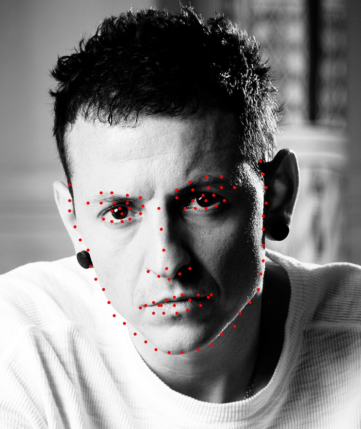

## High-resolution networks (HRNets) for facial landmark detection

### Simple inference example


```python

import cv2
from utils_inference import get_lmks_by_img, get_model_by_name, get_preds, decode_preds, crop
from utils_landmarks import show_landmarks, get_five_landmarks_from_net, alignment_orig

model = get_model_by_name('WFLW', device='cuda')

img = cv2.imread('./images/chester.jpg')
lmks = get_lmks_by_img(model, img) 
show_landmarks(img, lmks)


```
<div align=center>



</div>


### Overview

Authors extend the high-resolution representation (HRNet) [1] by augmenting the high-resolution representation by aggregating the (upsampled) 
representations from all the parallel convolutions, leading to stronger representations. The output representations are fed into
classifier. They evaluate our methods on four datasets, COFW, AFLW, WFLW and 300W and obtain state-of-the-art results. More details see in paper
[High-Resolution Representations for Facial Landmark Detection](https://arxiv.org/pdf/1904.04514.pdf). 


<div align=center>


</div>

 


### Other applications of HRNets (codes and models):
* [Human pose estimation](https://github.com/leoxiaobin/deep-high-resolution-net.pytorch)
* [Semantic segmentation](https://github.com/HRNet/HRNet-Semantic-Segmentation)
* [Object detection](https://github.com/HRNet/HRNet-Object-Detection)
* [Image classification](https://github.com/HRNet/HRNet-Image-Classification)
 
### Citation
If you find this work or code is helpful in your research, please cite:
````
@inproceedings{SunXLW19,
  title={Deep High-Resolution Representation Learning for Human Pose Estimation},
  author={Ke Sun and Bin Xiao and Dong Liu and Jingdong Wang},
  booktitle={CVPR},
  year={2019}
}

@article{SunZJCXLMWLW19,
  title={High-Resolution Representations for Labeling Pixels and Regions},
  author={Ke Sun and Yang Zhao and Borui Jiang and Tianheng Cheng and Bin Xiao 
  and Dong Liu and Yadong Mu and Xinggang Wang and Wenyu Liu and Jingdong Wang},
  journal   = {CoRR},
  volume    = {abs/1904.04514},
  year={2019}
}
````

### Reference
[1] Deep High-Resolution Representation Learning for Human Pose Estimation. Ke Sun, Bin Xiao, Dong Liu, and Jingdong Wang. CVPR 2019. [download](https://arxiv.org/pdf/1902.09212.pdf)

